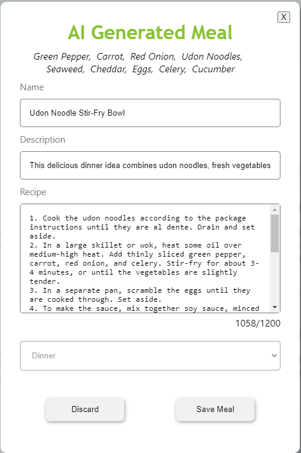

## A Food and Meal tracking service with the ability to AI generate meals!

### Features
- Add and manage foods in your virtual fridge
- Create and store meals you love to make
- Generate meals with the foods you desire using OpenAI API (ChatGPT)
- Track the age of your foods so they don't go rotten!

# Login Page

# User Fridge

# Add Food to Fridge

# Edit food

# Meals Page

# View a Meal

# Create a Meal

# AI Generate a Meal

