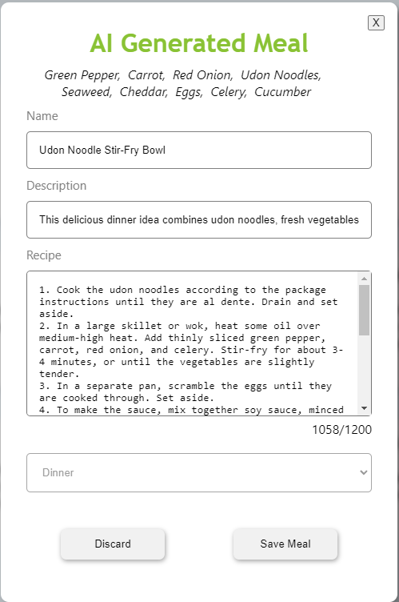

## A Food and Recipe tracking service with the ability to AI generate meals!

### Features
- Add and manage foods in your virtual fridge
- Create and store meals you love to make
- Generate meals with the foods you desire using OpenAI API (ChatGPT)
- Track the age of your foods so they don't go rotten!

### Exciting next steps
- Implement a Machine Learning model that parses a picture of a receipt in order to add all of the foods
- Create a 'grocery list' page

# Visuals

## Login Page

## User Fridge

## Add Food to Fridge

## Edit food

## Recipes Page

## View a Recipe

## Create a Recipe

## AI Generate a Recipe

